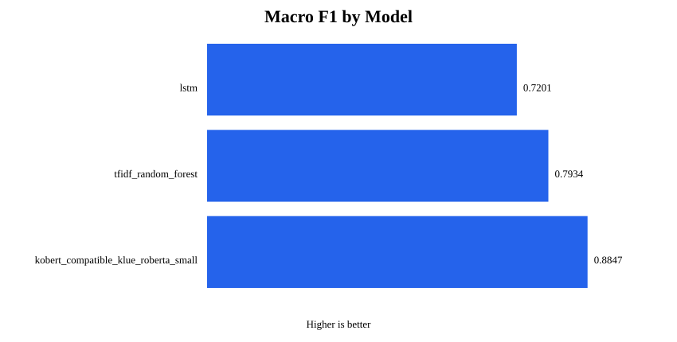
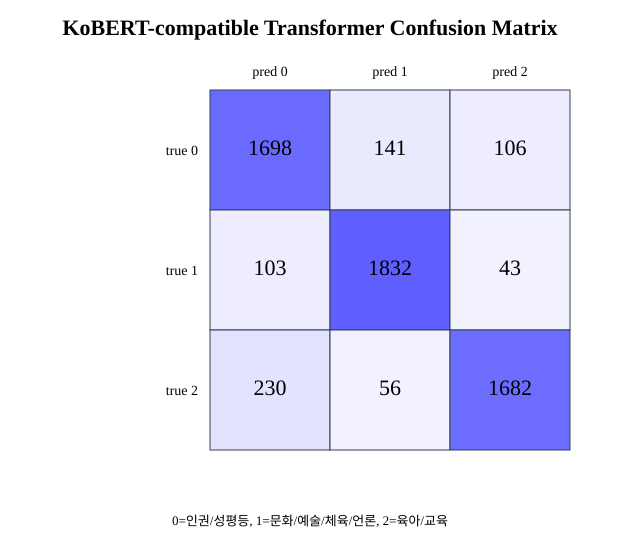

# 국민청원 데이터 기반 자연어 처리 프로젝트 결과보고서 원고

## 【서식 2】 산학협력 프로젝트 결과보고서

### 프로젝트 개요

표 1. 프로젝트 기본 정보

| 항목 | 내용 |
| --- | --- |
| 프로젝트명 | 국민청원 데이터 기반 자연어 처리 |
| 협력기관(국가) | 선문대학교 |
| 담당 교수 | 노영훈 |
| 수행기간 | 2026. 3. 3.(화) ~ 2026. 6. 19.(금) |
| 소요예산 | 0천원 |
| 참여인원 | 학부생 1명 |

### 추진배경

◦ 국민청원 데이터는 사회 이슈가 장문으로 작성된 대표적인 한국어 비정형 텍스트임  
◦ 사람이 직접 청원을 읽고 분류하면 시간과 비용이 크고 분류 기준의 일관성 확보가 어려움  
◦ 교재 수준의 RNN/LSTM 실습을 넘어 실제 프로젝트형 NLP 파이프라인 구축이 필요함  
◦ 국민청원 본문은 문장이 길고 복합 주제가 많아 단순 키워드 기반 분류에 한계가 있음  
◦ 로컬 Miniconda 및 PyTorch CUDA 환경에서 직접 학습하여 재현 가능한 실험 환경을 구성함  
◦ TF-IDF, LSTM, 한국어 Transformer를 비교하여 최신 모델 적용 효과를 검증하고자 함

### 목표 및 내용

◦ 주제: 국민청원 본문을 인권/성평등, 문화/예술/체육/언론, 육아/교육 3개 카테고리로 분류  
◦ 데이터: 데이콘 청와대 청원 분류 데이터 train.csv 40,000건, test.csv 5,000건 사용  
◦ 전처리: HTML, URL, 이메일, 특수문자, 결측치, 중복 본문 제거 및 도메인 불용어 정의  
◦ 모델링: TF-IDF Random Forest, LSTM, KoBERT 호환 Transformer를 동일 split에서 학습  
◦ 평가: Accuracy, Precision, Recall, F1-Score, Confusion Matrix로 성능 및 오분류 분석  
◦ 결과: KoBERT 호환 Transformer(`klue/roberta-small`)가 macro F1 0.8847로 최고 성능 달성

### 기대효과

◦ 한국어 장문 텍스트 분류를 위한 데이터 수집, 전처리, 학습, 평가 파이프라인 확보  
◦ Transformer 모델이 최고 베이스라인 대비 macro F1을 0.0912 개선하여 성능 향상 입증  
◦ 국민청원뿐 아니라 민원, VOC, 상담 로그, 게시판 텍스트 자동 분류에 확장 가능  
◦ Confusion Matrix 분석으로 인권/성평등과 육아/교육 간 오분류 등 개선 방향 도출  
◦ seed 고정, 동일 데이터 분할, 실험 로그 저장을 통해 재현 가능한 실험 관리 경험 확보  
◦ 로컬 GPU 학습과 최신 Transformer 적용 경험을 자연어처리 포트폴리오 산출물로 활용 가능

## 【서식 3】 연구 결과보고서

# 1. 기술개발의 목적 및 필요성

## 가. 기술개발의 목적

◦ 최종 목적  
- 국민청원 장문 텍스트를 입력받아 청원 카테고리를 자동 분류하는 자연어처리 모델 개발  
- 교재 수준의 RNN/LSTM 베이스라인보다 Transformer 기반 모델이 더 높은 성능을 보이는지 검증  
- 데이터 전처리, 모델링, 평가, 결과 해석을 포함한 재현 가능한 프로젝트 파이프라인 구축

◦ 분류 대상  
- 0번 라벨: 인권/성평등  
- 1번 라벨: 문화/예술/체육/언론  
- 2번 라벨: 육아/교육

◦ 세부 목적 1: 데이터 기반 문제 정의  
- 국민청원 데이터의 라벨 분포, 결측치, 중복, 텍스트 길이 확인  
- 장문 텍스트 특성을 고려한 전처리 및 모델 설계  
- 원본 데이터와 정제 데이터의 차이 기록

◦ 세부 목적 2: 전처리 기준 명확화  
- HTML 태그, URL, 이메일, 특수문자 제거  
- 결측 본문 및 완전 중복 본문 제거  
- “대통령님”, “청원합니다”, “부탁드립니다” 등 도메인 불용어 제거  
- `min_df`, `max_df` 선택 근거 기록

◦ 세부 목적 3: 모델별 공정 비교  
- 모든 모델에 동일한 train/validation/test split 적용  
- seed 42 고정  
- Accuracy, Precision, Recall, F1-Score, Confusion Matrix로 평가  
- 최고 베이스라인 대비 Transformer 개선폭 산출

◦ 세부 목적 4: 발표 및 포트폴리오 산출물 확보  
- `README.md`, `PLAN.md`, 단계별 보고서 작성  
- 학습 코드와 실험 결과를 파일로 보존  
- 발표 시 코드 흐름과 파라미터 선택 이유를 직접 설명할 수 있도록 정리

◦ 기술개발 목표의 차별화 포인트  
- 단순 Colab 실습이 아닌 로컬 개발 환경 기반 프로젝트로 수행  
- 교재 수준의 LSTM 구현에 머무르지 않고 한국어 Transformer 모델까지 비교  
- 데이터셋 변경에 맞추어 국민청원 도메인 전용 불용어와 전처리 규칙 직접 정의  
- 하이퍼파라미터 선택 이유를 보고서와 코드 주석에 남겨 설명 가능성 확보  
- 모델 성능 수치뿐 아니라 Confusion Matrix 기반 오분류 원인까지 분석

## 나. 기술개발의 필요성

◦ 국민청원 데이터 처리의 필요성  
- 청원 본문은 사회적 요구와 정책 개선 의견이 포함된 공공 텍스트 데이터임  
- 청원 문서 수가 많을 경우 사람이 직접 분류하기 어려움  
- 자동 분류 모델을 활용하면 주제별 분석과 이슈 파악이 효율화됨

◦ 한국어 장문 텍스트 분석의 필요성  
- 국민청원 본문은 평균 길이가 500자 이상임  
- 최대 길이가 수만 자에 이르는 긴 문서도 존재함  
- 짧은 문장 분류보다 문맥, 핵심 단서, 중복 표현 처리가 중요함

표 2. 데이터 품질 및 길이 특성

| 항목 | train | test |
| --- | ---: | ---: |
| 원본 행 수 | 40,000 | 5,000 |
| 결측 본문 | 8 | 0 |
| 중복 본문 | 637 | 25 |
| 평균 길이 | 546.05 | 550.59 |
| 중앙값 길이 | 313.00 | 300.00 |
| 최대 길이 | 32,767 | 28,904 |

◦ 데이터 관점의 필요성  
- train 데이터에 결측 본문과 중복 본문이 존재하여 전처리 없이는 학습 품질 저하 가능  
- test 데이터에도 중복 본문이 존재하지만 제출 형식의 `index` 보존이 필요하여 행 제거 없이 텍스트만 정제  
- 라벨 분포는 거의 균등하므로 불균형 보정보다 어휘 품질과 문맥 반영이 더 중요한 문제로 판단  
- 평균보다 중앙값이 낮고 최대 길이가 매우 커서 일부 초장문 청원이 전체 길이 분포를 크게 늘림  
- 장문 데이터 특성상 모델 입력 길이 제한, truncation, 문맥 손실을 반드시 고려해야 함

◦ 프로젝트 관리 관점의 필요성  
- 원본 데이터와 모델 파일은 대용량 또는 재생성 가능 파일이므로 공개 저장소에 직접 커밋하지 않음  
- 코드, 설정, 보고서, 요약 CSV, 시각화 파일 중심으로 저장소를 구성하여 재현성과 보안성을 함께 확보  
- GitHub 개인 접근 권한 정보는 보고서나 공개 저장소에 작성하지 않고 제출 전 폐기 및 재발급 여부 확인 필요  
- 발표 시 AI가 생성한 대본을 읽는 방식이 아니라 코드 흐름과 결과 근거를 직접 설명해야 함

◦ 기존 RNN/LSTM 방식의 한계  
- 입력 길이가 길어질수록 앞부분 문맥 유지가 어려움  
- `max_len=160` 제한으로 긴 청원 본문의 일부 정보가 잘릴 수 있음  
- 단어 단위 토큰화는 한국어 조사, 어미, 복합어 처리에 한계가 있음

◦ TF-IDF 기반 모델의 한계  
- 빠르고 안정적인 베이스라인 구축 가능  
- 단어 출현 빈도와 n-gram 패턴 학습에 강점  
- 문장 순서와 문맥 관계를 직접 반영하지 못함

◦ Transformer 적용의 필요성  
- subword tokenization으로 한국어 형태 변화에 대응 가능  
- self-attention으로 문서 내 여러 위치의 단서를 동시에 참조 가능  
- 사전학습된 한국어 표현 지식을 활용하여 적은 task-specific 데이터에서도 높은 성능 기대 가능

◦ 개선 방향  
- 단순 실습 구현이 아닌 실제 프로젝트형 파이프라인 구축 필요  
- 모델 성능뿐 아니라 전처리, 파라미터, 실험 조건의 선택 근거 제시 필요  
- Confusion Matrix 기반 오분류 분석을 통해 후속 개선 방향 도출 필요

# 2. 기술개발의 내용 및 방법

## 가. 기술개발의 내용

◦ 전체 개발 범위  
- 데이터 수집  
- 탐색적 데이터 분석  
- 도메인 맞춤형 전처리  
- 베이스라인 모델 학습  
- 한국어 Transformer fine-tuning  
- 모델 성능 비교  
- 오분류 분석  
- 결과보고서 및 발표자료 작성

◦ 로컬 개발 환경 구성  
- Miniconda 기반 가상환경 사용  
- PyTorch CUDA 버전 설치  
- RTX 3080 GPU에서 Transformer 전체 split 학습 수행  
- `requirements.txt`로 주요 Python 패키지 관리  
- Colab 실행 결과가 아니라 로컬 환경에서 재실행 가능한 코드 중심으로 구성

◦ 데이터 구성  
- 원본 학습 데이터: `train.csv` 40,000건  
- 원본 테스트 데이터: `test.csv` 5,000건  
- 학습 데이터 컬럼: `index`, `category`, `data`  
- 테스트 데이터 컬럼: `index`, `data`  
- 원본 대용량 CSV는 Git 커밋 대상에서 제외

◦ EDA 결과 요약  
- 세 카테고리의 라벨 분포가 거의 균등함  
- 인권/성평등: 13,301건  
- 문화/예술/체육/언론: 13,337건  
- 육아/교육: 13,362건  
- 별도 리샘플링 없이 stratified split 적용 가능

◦ 전처리 적용 내용  
- HTML 태그 제거  
- URL 제거  
- 이메일 형식 문자열 제거  
- 줄바꿈, 탭, 연속 공백 정규화  
- 한글, 영어, 숫자, 공백 외 특수문자 제거  
- 결측 본문 제거  
- 학습 데이터의 완전 중복 본문 제거  
- 국민청원 도메인 불용어 제거

◦ 노이즈 탐지 결과 해석  
- 특수문자는 거의 모든 청원 본문에 포함되어 있어 정규화 대상에 포함  
- URL은 외부 기사, 참고자료, 게시글 링크가 포함된 청원에서 주로 등장  
- HTML 태그는 데이터 수집 과정에서 포함된 잔여 마크업으로 판단  
- 이메일 형식 문자열은 개인정보 또는 문의 주소일 수 있으므로 제거 대상에 포함  
- 줄바꿈과 탭은 데이터 로드 이후 공백 정규화 단계에서 통합 처리

◦ 전처리 결과 해석  
- 정제 후 train 데이터는 39,272건으로 정리됨  
- 결측 및 중복 제거로 학습 데이터의 중복 편향 가능성 완화  
- 평균 길이는 546.05자에서 524.48자로 감소  
- 중앙값 길이는 313자에서 303자로 감소  
- 과도한 텍스트 손실 없이 노이즈 중심 정제가 수행됨

◦ 도메인 불용어 제거 내용  
- 목적: 카테고리 분류와 직접 관련 없는 반복 표현 제거  
- 방식: `configs/stopwords_petition.txt`에 직접 정의  
- 대상: 청원 양식상 반복되는 표현, 호소 표현, 예의 표현  
- 효과: 상위 빈도 토큰에서 청원 관용 표현 제거

◦ TF-IDF 어휘 파라미터 설정  
- 선택값: `min_df=3`, `max_df=0.85`  
- 선택 어휘 수: 140,755개  
- `min_df=3`: 한두 문서에만 등장하는 오탈자, 희소 고유명사, 잡음 제거 목적  
- `max_df=0.85`: 대부분 문서에 반복되는 범용 표현 제거 목적  
- 사회 이슈 핵심 단어가 과도하게 제거되지 않도록 0.85로 설정

◦ 모델 개발 내용  
- TF-IDF Random Forest는 전통적인 머신러닝 기준 성능 확보 목적  
- LSTM은 교재 실습 수준의 순차 딥러닝 기준 성능 확보 목적  
- KoBERT 호환 Transformer는 최신 한국어 사전학습 모델 적용 효과 검증 목적  
- 세 모델 모두 동일한 정제 데이터와 동일한 split 기준으로 비교  
- 모델별 결과는 CSV, 학습 로그, Confusion Matrix로 저장

## 나. 기술개발의 연구 방법

◦ 연구 방법 원칙  
- 동일 데이터 분할 사용  
- 동일 평가 지표 사용  
- seed 고정  
- 모델별 실험 로그 저장  
- 파라미터 선택 근거 기록  
- 최종 test split 기준 성능 비교

표 3. 학습/검증/테스트 분할

| split | rows | 인권/성평등 | 문화/예술/체육/언론 | 육아/교육 |
| --- | ---: | ---: | ---: | ---: |
| train | 27,490 | 9,078 | 9,230 | 9,182 |
| validation | 5,891 | 1,945 | 1,978 | 1,968 |
| test | 5,891 | 1,945 | 1,978 | 1,968 |

◦ 1단계: 데이터 수집 및 원본 관리  
- `train.csv`, `test.csv`를 `data/raw` 경로에 저장  
- 원본 CSV는 대용량 파일이므로 Git 커밋 제외  
- 데이터 출처와 관리 기준은 `docs/DATA_SOURCE.md`에 기록

◦ 2단계: EDA 수행  
- 라벨 분포 확인  
- 결측치 및 중복 본문 확인  
- 텍스트 길이 통계 산출  
- 장문 데이터 특성 확인  
- 모델 입력 길이 제한의 영향 분석 준비

◦ 3단계: 전처리 수행  
- 정규표현식 기반 노이즈 제거  
- 결측 및 중복 데이터 정리  
- 도메인 불용어 제거  
- TF-IDF 어휘 사전 후보 실험  
- 정제 데이터와 split index 저장

◦ 4단계: 베이스라인 학습  
- TF-IDF Random Forest 학습  
- LSTM 학습  
- 동일 split과 동일 seed 사용  
- `reports/outputs/baseline_metrics.csv`에 결과 저장  
- `logs/lstm_training_log.csv`에 LSTM 학습 로그 저장

◦ TF-IDF Random Forest 설정 근거  
- n-gram 1~2를 사용하여 단어 단위와 짧은 구문 패턴을 함께 반영  
- `max_features=20000`으로 계산량과 어휘 표현력 사이의 균형 확보  
- `min_samples_leaf=2`로 지나치게 세부적인 분기와 과적합 가능성 완화  
- `random_state=42`로 실험 재현성 확보

◦ LSTM 설정 근거  
- vocab 20,000으로 빈도 기반 주요 단어 중심 학습  
- `max_len=160`으로 입력 길이를 고정하여 batch 학습 가능하게 구성  
- embedding 64, hidden 64로 과도한 모델 복잡도 방지  
- epoch 5로 기본 순차 모델의 학습 추이를 확인  
- CPU 학습 기준으로도 재현 가능한 베이스라인 확보

◦ 5단계: Transformer fine-tuning  
- 최초 후보: `monologg/distilkobert`  
- 문제: 현재 Transformers 환경에서 tokenizer 로딩 실패  
- 대체 모델: `klue/roberta-small`  
- 선택 이유: Hugging Face에서 안정적으로 로딩 가능한 한국어 Transformer 모델  
- 학습 환경: PyTorch CUDA, RTX 3080

표 4. Transformer 학습 설정

| 항목 | 값 |
| --- | --- |
| 모델 | `klue/roberta-small` |
| Seed | 42 |
| Max length | 160 |
| Batch size | 32 |
| Epochs | 3 |
| Learning rate | 2e-5 |
| Weight decay | 0.01 |
| Device | CUDA |
| Train samples | 27,490 |
| Validation samples | 5,891 |
| Test samples | 5,891 |

◦ Transformer 파라미터 선택 근거  
- `max_length=160`: GPU 메모리와 장문 문맥 반영 사이의 균형 고려  
- `batch_size=32`: RTX 3080 환경에서 안정적으로 학습 가능한 크기  
- `epochs=3`: 1 epoch보다 충분한 학습을 수행하되 과도한 학습 시간 방지  
- `learning_rate=2e-5`: BERT 계열 fine-tuning에서 안정적인 보수적 학습률  
- `weight_decay=0.01`: fine-tuning 중 과적합 완화 목적  
- seed 42: 모델별 성능 비교의 재현성 확보

◦ 모델 대체 결정 근거  
- 최초 계획은 KoBERT 계열 모델을 직접 사용하는 것이었음  
- `monologg/distilkobert`는 현재 설치된 Transformers 환경에서 tokenizer 로딩 문제가 발생  
- 프로젝트 마감과 재현성을 고려하여 즉시 로딩 가능한 한국어 Transformer 모델로 대체  
- `klue/roberta-small`은 한국어 데이터에 사전학습된 경량 Transformer 모델로 로컬 GPU 학습에 적합  
- 모델명은 KoBERT 자체는 아니지만, 한국어 Transformer 기반 실험군이라는 평가 목적에는 부합

◦ 평가 지표  
- Accuracy: 전체 정답 비율 확인  
- Macro Precision: 클래스별 precision을 동일 가중치로 평균  
- Macro Recall: 클래스별 recall을 동일 가중치로 평균  
- Macro F1: 클래스 균형 성능의 핵심 비교 지표  
- Weighted F1: support를 반영한 전체 성능 참고 지표  
- Confusion Matrix: 카테고리 간 오분류 패턴 분석

# 3. 기술개발의 연구결과

◦ 최종 결과 요약  
- 최고 성능 모델: KoBERT 호환 Transformer  
- 사용 모델: `klue/roberta-small`  
- 최종 macro F1: 0.8847  
- 목표 macro F1 0.88 달성  
- 최고 베이스라인 대비 macro F1 +0.0912 개선  
- LSTM 대비 macro F1 +0.1646 개선

표 5. 최종 모델별 성능

| 모델 | Accuracy | Macro Precision | Macro Recall | Macro F1 | Weighted F1 | 학습/추론 시간(초) |
| --- | ---: | ---: | ---: | ---: | ---: | ---: |
| TF-IDF Random Forest | 0.7934 | 0.7939 | 0.7933 | 0.7934 | 0.7936 | 25.53 |
| LSTM | 0.7225 | 0.7213 | 0.7219 | 0.7201 | 0.7205 | 384.68 |
| KoBERT 호환 Transformer | 0.8847 | 0.8859 | 0.8846 | 0.8847 | 0.8848 | 427.07 |

그림 1. 최종 모델별 Macro F1 비교

◦ TF-IDF Random Forest 결과  
- Accuracy: 0.7934  
- Macro F1: 0.7934  
- 장점: 빠른 학습, 안정적인 기준 성능  
- 한계: 문장 순서와 문맥 관계 반영 어려움  
- 역할: 최고 베이스라인 모델
- 해석: 카테고리별 핵심 단어가 명확한 문서에서는 안정적인 분류 가능  
- 해석: 국민청원처럼 맥락이 겹치는 장문 문서에서는 단어 출현만으로 구분이 어려운 경우 존재

◦ LSTM 결과  
- Accuracy: 0.7225  
- Macro F1: 0.7201  
- 장점: 순차 정보 반영 가능  
- 한계: 긴 청원 본문에서 입력 truncation 영향 큼  
- 한계: 단어 단위 토큰화로 한국어 형태 변화 반영 부족  
- 역할: 교재 수준 RNN/LSTM 비교군
- 해석: 순차 모델 구조 자체는 문장 흐름 반영이 가능하지만, 제한된 입력 길이와 작은 모델 크기가 성능을 제한  
- 해석: 평균 길이 500자 이상의 장문 청원에서는 핵심 근거가 뒤쪽에 위치할 경우 정보 손실 가능

◦ KoBERT 호환 Transformer 결과  
- Accuracy: 0.8847  
- Macro F1: 0.8847  
- Weighted F1: 0.8848  
- Best validation macro F1: 0.8895  
- 장점: subword tokenization 및 self-attention 활용  
- 장점: 한국어 사전학습 표현 지식 활용  
- 역할: A학점 목표를 위한 최신 모델 실험군
- 해석: 세 카테고리 모두에서 베이스라인 대비 높은 recall 확보  
- 해석: 문장 내 여러 위치의 단서를 동시에 참조하는 self-attention 구조가 장문 청원 분류에 효과적  
- 해석: 한국어 사전학습 모델의 표현력이 데이터셋 변경 상황에서도 성능 개선에 기여

◦ 카테고리별 성능 해석  
- 문화/예술/체육/언론 recall이 가장 높음  
- 인권/성평등과 육아/교육 사이의 혼동이 상대적으로 큼  
- 두 카테고리는 아동, 학교, 보호, 제도 개선, 폭력, 차별 등 사회정책 어휘를 공유함  
- 카테고리 간 경계가 명확한 경우 Transformer 성능이 높게 나타남

그림 2. KoBERT 호환 Transformer 모델의 Confusion Matrix

◦ 주요 오분류 패턴  
- 육아/교육 → 인권/성평등: 230건  
- 인권/성평등 → 문화/예술/체육/언론: 141건  
- 인권/성평등 → 육아/교육: 106건  
- 오분류 원인: 사회정책, 아동, 학교, 보호, 차별 등 공통 어휘 존재  
- 개선 방향: 문단 단위 예측 앙상블, 더 긴 입력 길이, 계층적 분류 검토

표 6. Transformer 모델 주요 오분류 패턴

| 실제 라벨 | 예측 라벨 | 건수 | 실제 라벨 내 비율 |
| --- | --- | ---: | ---: |
| 육아/교육 | 인권/성평등 | 230 | 11.69% |
| 인권/성평등 | 문화/예술/체육/언론 | 141 | 7.25% |
| 인권/성평등 | 육아/교육 | 106 | 5.45% |

◦ 최종 연구결과 1: 전처리 결과  
- train 원본 40,000건에서 정제 후 39,272건 확보  
- 결측 및 중복 데이터 제거  
- test 데이터 5,000건은 index 보존을 위해 행 제거 없이 텍스트 정제만 적용  
- 청원 도메인 반복 표현 제거  
- TF-IDF 어휘 수 140,755개로 관리

◦ 최종 연구결과 1-1: 전처리 품질 평가  
- 결측 본문과 중복 본문 제거로 학습 데이터 품질 개선  
- 불용어 제거 후에도 평균 길이가 급격히 줄지 않아 핵심 문맥 보존  
- 정제 규칙을 코드화하여 동일 데이터 재처리 가능  
- 원본 데이터와 정제 데이터의 행 수 변화를 기록하여 전처리 투명성 확보

◦ 최종 연구결과 2: 모델 성능 결과  
- Transformer 모델이 모든 핵심 지표에서 최고 성능 달성  
- macro F1 0.8847로 목표 0.88 이상 달성  
- LSTM 대비 큰 폭의 성능 개선 확인  
- Random Forest 대비 문맥 반영 효과 확인

◦ 최종 연구결과 2-1: 목표 달성 여부  
- 설정 목표: macro F1 0.88 이상 또는 베이스라인 대비 유의미한 개선  
- 실제 결과: Transformer macro F1 0.8847  
- 목표 달성 여부: 달성  
- 최고 베이스라인 대비 개선폭: +0.0912  
- 교재 수준 LSTM 대비 개선폭: +0.1646

◦ 최종 연구결과 3: 모델별 한계 확인  
- Random Forest: 문맥 반영 부족  
- LSTM: 긴 문서 입력 손실과 한국어 형태 처리 한계  
- Transformer: 성능은 가장 높으나 학습 시간이 길고 긴 본문 일부 truncation 존재  
- 공통 한계: 인권/성평등과 육아/교육처럼 주제가 겹치는 청원에서 오분류 발생

◦ 최종 연구결과 3-1: 후속 개선 방향  
- 긴 본문을 문단 단위로 분할한 뒤 예측 결과를 앙상블하는 방식 검토  
- `max_length`를 256 또는 512로 늘린 추가 실험 검토  
- KoELECTRA, KLUE-RoBERTa-base 등 더 큰 한국어 모델과 비교 가능  
- 오분류가 많은 카테고리에 대해 키워드 및 사례 분석 추가 가능  
- 인권/성평등과 육아/교육을 상위 사회정책 카테고리로 묶는 계층적 분류 검토 가능

◦ 최종 연구결과 4: 산출물 정리  
- 모든 전처리와 학습 코드를 Python 파일로 보존  
- 결과 CSV, 학습 로그, 시각화 파일 생성  
- README, PLAN, 단계별 보고서 작성  
- 발표 시 재현 가능한 근거 자료 확보

◦ 발표 시 핵심 설명 포인트  
- 왜 국민청원 데이터가 장문 텍스트 분류 문제인지 설명  
- 왜 결측, 중복, URL, 특수문자, 도메인 불용어 제거가 필요한지 설명  
- 왜 `min_df=3`, `max_df=0.85`를 선택했는지 설명  
- 왜 LSTM보다 Transformer가 유리한지 구조적으로 설명  
- 왜 `monologg/distilkobert` 대신 `klue/roberta-small`을 사용했는지 설명  
- 최종 macro F1 0.8847과 베이스라인 대비 개선폭을 중심으로 결과 설명

# 4. 기술개발의 활용방안 및 기대효과

## 가. 기술개발의 활용방안

◦ 공공 민원 자동 분류  
- 국민청원, 국민신문고, 지자체 민원 분류에 적용 가능  
- 민원 담당 부서 자동 배정 보조 가능  
- 반복 민원과 주요 사회 이슈 탐지 가능

◦ 기업 VOC 및 상담 로그 분석  
- 고객센터 상담 내용 자동 분류 가능  
- 제품, 서비스, 결제, 배송 등 업무 카테고리 분류에 응용 가능  
- 장문 문의의 핵심 주제 파악 시간 단축 가능

◦ 교육 및 포트폴리오 활용  
- 자연어처리 프로젝트 포트폴리오로 활용 가능  
- 데이터 수집, 전처리, 모델링, 평가, 문서화 흐름 제시 가능  
- 면접 및 발표에서 모델 선택 근거와 결과 해석 설명 가능

◦ 후속 연구 확장  
- 문단 단위 예측 앙상블 적용 가능  
- 더 큰 한국어 사전학습 모델 비교 가능  
- 계층적 분류 또는 multi-label 분류 방식 검토 가능  
- 오분류가 많은 카테고리에 대한 추가 데이터 분석 가능

## 나. 기술개발의 기대효과

◦ 기술적 기대효과  
- 한국어 장문 텍스트 분류 실험 구조 확보  
- 전처리, 베이스라인, Transformer 비교 가능  
- macro F1, 클래스별 recall, Confusion Matrix 기반 평가 체계 확보  
- 파라미터 선택 근거와 실험 로그 관리 체계 확보

◦ 실무적 기대효과  
- 공공 데이터 기반 텍스트 자동 분류 가능성 확인  
- 대량 문서의 주제별 구조화 업무 효율화 가능  
- 빠른 모델과 고성능 모델의 선택 기준 제시 가능

◦ 인재 양성 기대효과  
- 로컬 환경 구축 및 GPU 학습 경험 확보  
- 자연어처리 전처리와 모델 평가 역량 강화  
- 최신 Transformer 모델 fine-tuning 경험 확보  
- 코드 흐름, 파라미터 이유, 성능 결과를 직접 설명할 수 있는 발표 역량 확보

# 5. 참여 연구원 현황

## 가. 연구 책임자

표 7. 연구 책임자

| 항목 | 내용 |
| --- | --- |
| 성명 | 노영훈 |
| 소속 | 선문대학교 |
| 연락처 | 원본 HWP 서식의 개인정보 항목에 기재 |
| 이메일 | 원본 HWP 서식의 개인정보 항목에 기재 |

## 나. 산업체 연구원

표 8. 산업체 연구원

| 항목 | 내용 |
| --- | --- |
| 성명 | 해당 없음 |
| 소속 | 해당 없음 |
| 연락처 | 해당 없음 |
| 이메일 | 해당 없음 |

## 다. 학생 연구원

표 9. 학생 연구원

| 항목 | 내용 |
| --- | --- |
| 성명/학번 | 임성훈 / 원본 HWP 서식에 기재 |
| 소속/과정 | 컴퓨터공학부 / 학부생 |
| GitHub Repository 주소 | `https://github.com/SH-L1/NLPpj` |
| GitHub 개인 접근 권한 정보 | 공개 문서에 기재하지 않음. 제출 전 기존 개인 접근 권한 폐기 및 재발급 여부 확인 |
| 연락처/이메일 | 원본 HWP 서식의 개인정보 항목에 기재 |

# 6. 참고문헌

◦ 데이콘  
- “청와대 청원 : 청원 카테고리 분류 AI 경진대회 데이터”  
- https://dacon.io/competitions/official/235658/data

◦ Hugging Face  
- “klue/roberta-small Model Card”  
- https://huggingface.co/klue/roberta-small

◦ Devlin, J., Chang, M. W., Lee, K., and Toutanova, K.  
- “BERT: Pre-training of Deep Bidirectional Transformers for Language Understanding”  
- NAACL-HLT, 2019.

◦ Vaswani, A. et al.  
- “Attention Is All You Need”  
- Advances in Neural Information Processing Systems, 2017.

◦ scikit-learn developers  
- “scikit-learn: Machine Learning in Python”  
- https://scikit-learn.org/stable/

◦ PyTorch Contributors  
- “PyTorch Documentation”  
- https://pytorch.org/docs/stable/index.html

◦ Hugging Face  
- “Transformers Documentation”  
- https://huggingface.co/docs/transformers/
